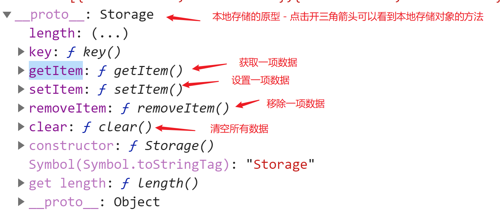

## 今天目标

WebAPI + jQuery 复习。

案例：微博发布效果(复习)，todoList (难点) 。


## 浏览器本地存储

localStorage 对象管理。

本地存储只能保存 字符串。




## contentEditable 新属性

https://www.w3school.com.cn/html5/att_global_contenteditable.asp

一段可编辑的段落：

```html
<p contenteditable="true">这是一段可编辑的段落。请试着编辑该文本。</p>
```

JS 方式修改元素的可编辑属性。

```js
element.contentEditable = true;
```

注意：JS 这里的 contentEditable 的字母 E 是大写E。

